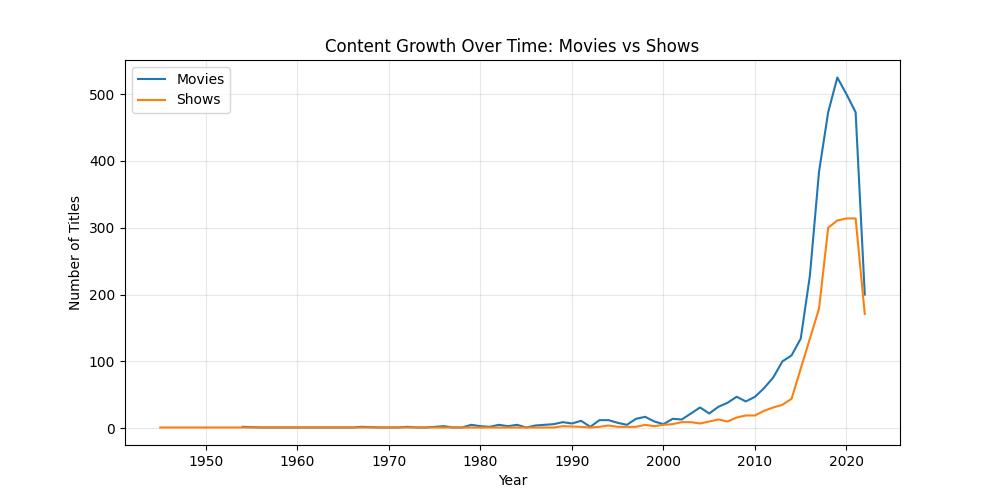
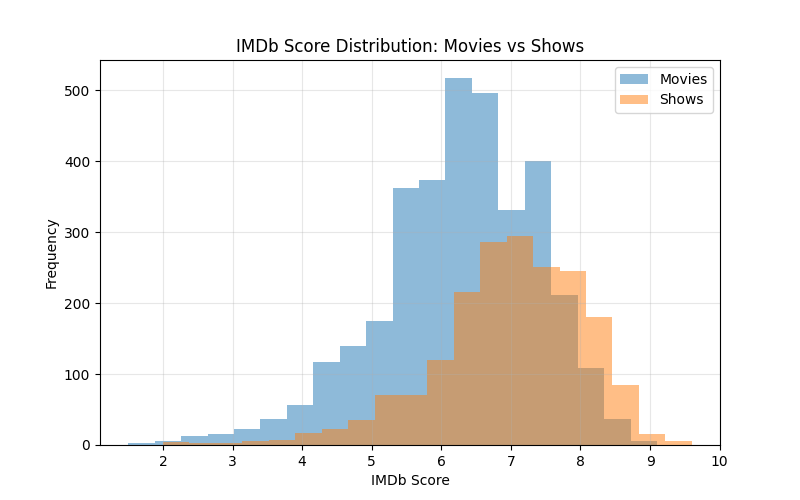

# Netflix Content Analysis

## Visual Insights

### Content Growth Over Time

### IMDb Score Distribution

---

## Project Overview

This project analyzes Netflix’s content catalog to uncover trends in growth, content strategy, and audience reception.

The analysis focuses on how Netflix has expanded over time, the differences between movies and TV shows, and how content characteristics such as ratings, duration, and genres vary across the platform.

---

## Key Insights

* Netflix experienced rapid content growth after 2010, peaking around 2019
* Movies drove early expansion, while TV shows became increasingly dominant over time
* TV shows tend to have higher and more consistent IMDb ratings than movies
* Average movie runtime has decreased over time, while TV show length remains stable
* Content production is concentrated in a small number of countries
* A limited number of genres dominate the platform’s catalog

---

## Dataset

The dataset contains information on Netflix titles, including:

* Content type (Movie or TV Show)
* Release year
* IMDb score
* Runtime and number of seasons
* Production countries
* Genres

---

## Tools & Technologies

* Python
* Pandas
* Matplotlib

---

## Project Structure

* `netflix_analysis.ipynb` = Full exploratory data analysis
* `titles.csv` = Dataset used for analysis
* `README.md` = Project overview and key findings

---

## Objective

The goal of this project is to apply exploratory data analysis techniques to a real-world dataset and extract meaningful insights about content trends and platform strategy.

---

## Summary

Netflix’s growth reflects a shift from a movie-focused catalog to a strategy centered on scalable, serialized content. The platform emphasizes globally produced content while maintaining a focus on high-demand genres that maximize audience engagement.

